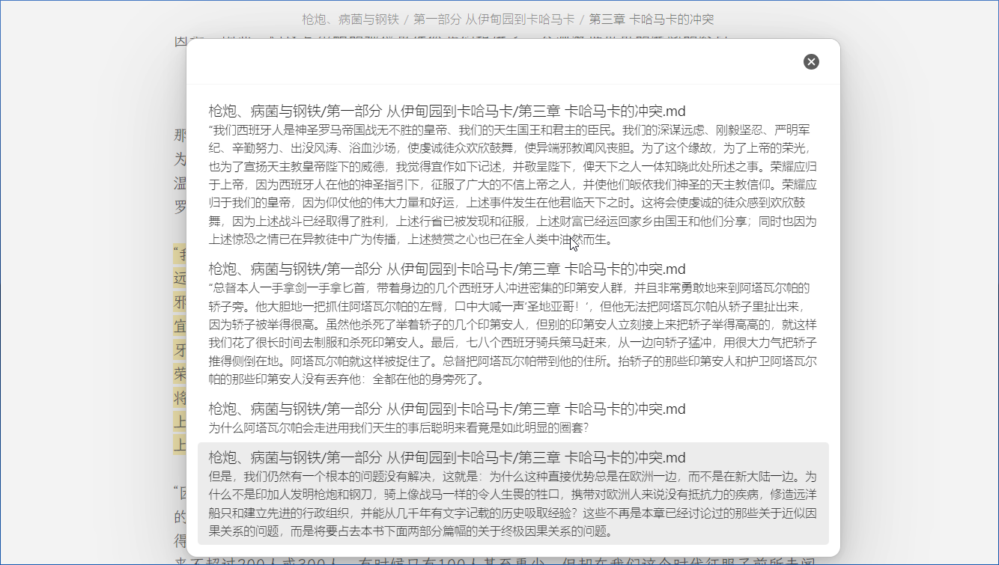

# 📝Highlighter

Manage, display the highlights, and comment them in a elegant way.

## ⚡Usage

> [!warning]
> It's still early days for this plugin, I suggest you just try using it with the [epub importer](https://github.com/aoout/obsidian-epub-importer) to highlight books and manage higlights.

### 📖With Epub Importer

> [!note]
> Please set the setting tags on `highlighter` and `epub importer` to be the same.

When **oneNote** is off, the book chapter notes will be scattered in a folder. In this case, all these notes are called an **HighlightBox**.

So when your activeNote is one of the notes, you are in this HighlightBox, and you can search all the highlights of this book through the `Search highlights in current HighlightBox` command.

Moreover, when you are in a HighlightBox, by running the `Update highlights file` command, you can generate a **highlights.md** file, located in the root directory of the HighlightBox.

If you want to comment a highlight, you can type an @ symbol and then write the comment on a new line. If your input conforms to the format, your comments will be retained when the `Update highlights file` command updates the highlights.md file.

When a highlight has a corresponding comment, place the mouse on the highlight and press the `ctrl` key, a pop-up window will display the comment.

## 🖼️GIFs

### Jump to highlight

